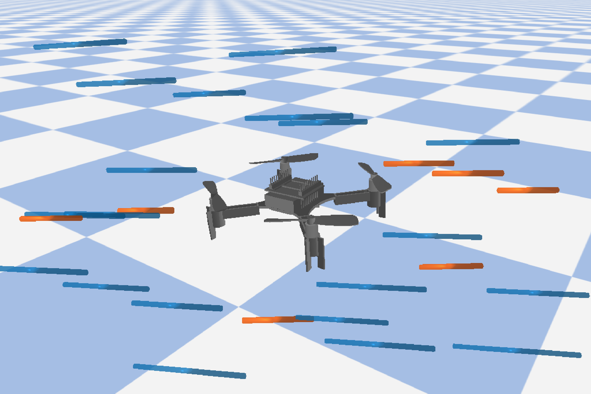
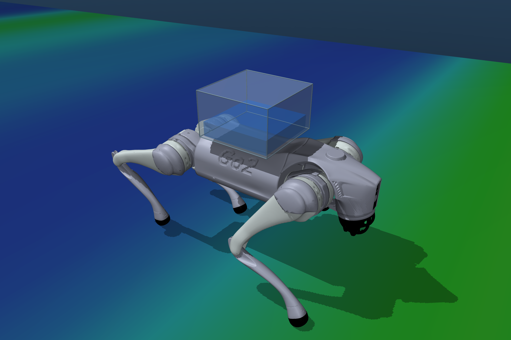
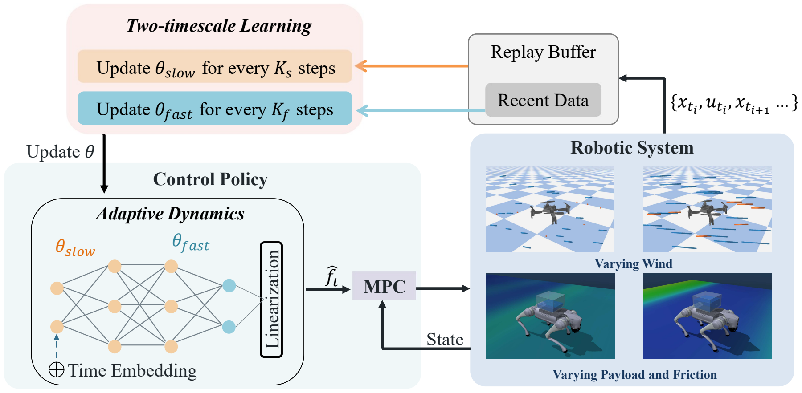

# T2S-MPC: Real-Time Online Adaptive Model Predictive Control for Continuously Changing Dynamics

PyTorch and acados implementation of **T2S-MPC** for online adaptation to time-varying robot dynamics, with quadrotor and Unitree Go2 simulation experiments.

[Method](#method) · [Installation](#installation) · [Experiments](#experiments) · [Code](#code)

<table>
  <tr><td align="center"></td><td align="center"></td></tr>
  <tr><td align="center"><b>Quadrotor: time-varying wind</b></td><td align="center"><b>Go2: changing payload and friction</b></td></tr>
</table>

## Method

**T2S-MPC** learns a time-conditioned neural residual model to compensate for changing dynamics. Fast updates adapt the output layer using recent observations; slow updates refine the hidden representation using recent and historical data. The residual is linearized along the predicted trajectory and incorporated into MPC, while model learning runs asynchronously with control.

<p align="center">
  
</p>

## Installation

Use **Linux x86-64**, Conda, Git, and a C/C++ build toolchain. Create the environment and install the simulation dependencies:

```bash
git clone https://github.com/Zeyuu0920/real-time-T2S-MPC.git
cd real-time-T2S-MPC
conda env create -f environment.yaml
conda activate t2s-mpc
bash scripts/setup.sh --system all
```

Use `--system quadrotor` or `--system go2` to install only the corresponding simulator. The setup script installs the Python packages, builds acados, and checks out the pinned external dependencies. Add `--dry-run` to inspect these commands before installation.

<details>
<summary>Dependency versions and installation notes</summary>

- Python 3.10, PyTorch 2.5.1, and L4CasADi 2.0.0; PyTorch is installed before building L4CasADi.
- Quadrotor: PyBullet 3.2.7 and safe-control-gym. Go2: MuJoCo 3.3.0 and Pinocchio (`pin` 4.1.0).
- Source revisions are recorded in [dependencies.json](docs/dependencies.json); Python versions are in [requirements/](requirements/). External checkouts and native libraries stay under `external/`.
- The recorded safe-control-gym checkout declares PyTorch `^2.8`, while the research environment uses 2.5.1. Setup uses `--no-deps` for that checkout to retain the recorded versions; a declared dependency conflict remains.
- First-time solver generation may download the Tera renderer. Video rendering also needs OpenGL/EGL or OSMesa. The experiment entrypoints configure their native-library paths automatically.

</details>

## Experiments

Run T2S-MPC in either simulator:

```bash
python scripts/run_quadrotor.py --method t2s --scenario combined --seed 42
python scripts/run_go2.py --method t2s --scenario combined --seed 42
```

| System | `--scenario` | Trial duration |
| --- | --- | --- |
| Quadrotor | `mwi` (mean wind increase), `tii` (turbulence increase), `combined` | 20 s |
| Go2 | `drain`, `friction`, `combined` | 60 s |

Set `--method` to `nominal`, `ssi`, or `stgp` to run a baseline. The selected seeds are 42–51. Outputs are saved under `outputs/`; use `--output-dir` to choose another location. Both scripts provide `--help` and a `--dry-run` mode that works without the simulation dependencies.

The quadrotor defaults pin control to CPU 2 and training to CPU 4; use `--no-affinity` on machines without those CPUs. Run trials serially within a checkout. Configurations, timing assumptions, and reporting details are described in [experiment protocols](docs/experiments.md).

## Code

| To… | Start with… |
| --- | --- |
| Run an experiment | [scripts/](scripts/) |
| Inspect or change experiment settings | [configs/](configs/) |
| Study the learning algorithm | [models.py](src/models.py), [realtime_t2s.py](src/realtime_t2s.py), [hybrid_replay.py](src/hybrid_replay.py) |
| Run the unit tests | [tests/](tests/) |

Core and numerical tests have been run in the research environment. Clean installation and full closed-loop reproduction remain under validation; see the [validation notes](docs/validation.md).

## Acknowledgements

This implementation uses [acados](https://github.com/acados/acados), [L4CasADi](https://github.com/Tim-Salzmann/l4casadi), [safe-control-gym](https://github.com/learnsyslab/safe-control-gym), and [go2-convex-mpc](https://github.com/elijah-waichong-chan/go2-convex-mpc), with GP components from [L4acados](https://github.com/IntelligentControlSystems/l4acados). Third-party dependencies retain their respective licenses.
