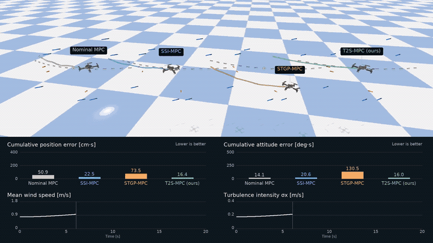

# T2S-MPC: Real-Time Online Adaptive Model Predictive Control for Continuously Changing Dynamics

PyTorch and acados implementation of **T2S-MPC** for online adaptation to time-varying robot dynamics, with quadrotor and Unitree Go2 simulation experiments.

## Table of Contents

- [Demonstration Video](#demonstration-video)
- [Method](#method)
- [Installation](#installation)
- [How to Run](#how-to-run)
  - [Quadrotor: wind and turbulence](#quadrotor-wind-and-turbulence)
  - [Go2: payload and ground friction](#go2-payload-and-ground-friction)
- [Reproduce Paper Results](#reproduce-paper-results)
- [Project Structure](#project-structure)
- [Acknowledgements](#acknowledgements)

## Demonstration Video

[](https://github.com/Zeyuu0920/real-time-T2S-MPC/blob/main/media/t2s-mpc-demo.mp4)

**[Watch the full demonstration (2:01, with audio)](https://github.com/Zeyuu0920/real-time-T2S-MPC/raw/refs/heads/main/media/t2s-mpc-demo.mp4).** The preview shows short excerpts; the full video includes quadrotor and Go2 simulations and the real-world wind experiment. This repository provides the two simulation implementations. [Video details](docs/demo.md).

## Method

**T2S-MPC** learns a time-conditioned neural residual model to compensate for changing dynamics. Fast updates adapt the output layer using recent observations; slow updates refine the hidden representation using recent and historical data. The residual is linearized along the predicted trajectory and incorporated into MPC, while model learning runs asynchronously with control.

<p align="center">
  
</p>

## Installation

Use **Linux x86-64**, Conda, Git, and a C/C++ build toolchain. Create the environment and install the simulation dependencies:

```bash
git clone https://github.com/Zeyuu0920/real-time-T2S-MPC.git
cd real-time-T2S-MPC
conda env create -f environment.yaml
conda activate t2s-mpc
bash scripts/setup.sh --system all
```

Use `--system quadrotor` or `--system go2` to install only the corresponding simulator. The setup script installs the Python packages, builds acados, and checks out the pinned external dependencies. Add `--dry-run` to inspect these commands before installation.

<details>
<summary>Dependency versions and installation notes</summary>

- Python 3.10, PyTorch 2.5.1, and L4CasADi 2.0.0; PyTorch is installed before building L4CasADi.
- Quadrotor: PyBullet 3.2.7 and safe-control-gym. Go2: MuJoCo 3.3.0 and Pinocchio (`pin` 4.1.0).
- Source revisions are recorded in [dependencies.json](docs/dependencies.json); Python versions are in [requirements/](requirements/). External checkouts and native libraries stay under `external/`.
- The recorded safe-control-gym checkout declares PyTorch `^2.8`, while the research environment uses 2.5.1. Setup uses `--no-deps` for that checkout to retain the recorded versions; a declared dependency conflict remains.
- First-time solver generation may download the Tera renderer. Video rendering also needs OpenGL/EGL or OSMesa. The experiment entrypoints configure their native-library paths automatically.

</details>

## How to Run

Run a single experiment, choose a controller, and adjust the disturbance strength from the command line. `--method` accepts `t2s`, `nominal`, `ssi`, or `stgp`. Add `--dry-run` to inspect the effective settings without installing or starting a simulator.

### Quadrotor: wind and turbulence

<p align="center">
  
</p>

```bash
python scripts/run_quadrotor.py --method t2s --scenario combined --seed 42
```

Choose `mwi` (increasing mean wind), `tii` (increasing turbulence), or `combined`. Each trial lasts 20 s by default.

| Option | Effect | Default |
| --- | --- | --- |
| `--wind-scale` | Multiply the initial and final mean-wind vectors | `1.0` |
| `--turbulence-scale` | Multiply the initial and final turbulence standard deviations | `1.0` |
| `--duration` | Simulation duration in seconds | `20` |
| `--seed` | Random seed | `42` |

For example, increase mean wind by 50% and halve the turbulence:

```bash
python scripts/run_quadrotor.py --method t2s --scenario combined \
  --seed 123 --wind-scale 1.5 --turbulence-scale 0.5 \
  --output-dir outputs/quadrotor_custom
```

Both scale factors accept zero. They preserve the spatial pattern parameters and ramp duration. The defaults pin control to CPU 2 and training to CPU 4; add `--no-affinity` on machines without those CPUs, or choose cores with `--control-cpu-core` and `--trainer-cpu-core`.

### Go2: payload and ground friction

<p align="center">
  
</p>

```bash
python scripts/run_go2.py --method t2s --scenario combined --seed 42
```

Choose `drain` (draining liquid on uniform ground), `friction` (fixed payload on varying ground), or `combined`. Trials target 60 s. Seeds 42–51 select the stored spatial fields shared across controllers.

| Option | Effect | Applies to |
| --- | --- | --- |
| `--liquid-mass-scale` | Scale the liquid mass throughout draining; keep the 0.6 kg container | `drain`, `combined` |
| `--payload-mass` | Fixed payload mass in kg; default `4.0` | `friction` |
| `--friction-min`, `--friction-max` | Remap ground sliding friction to a new interval; default `[0.50, 0.80]` | `friction`, `combined` |
| `--ground-friction` | Uniform ground sliding friction; default `0.8` | `drain` |

For example, use 50% more liquid and a more slippery ground interval:

```bash
python scripts/run_go2.py --method t2s --scenario combined --seed 42 \
  --liquid-mass-scale 1.5 --friction-min 0.3 --friction-max 0.6 \
  --output-dir outputs/go2_custom
```

The liquid default is 3.4 → 1.4 kg during 5–45 s, in addition to the container. Friction overrides preserve the seed's spatial pattern and change the simulated ground; the MPC friction-cone coefficient stays at `0.5`.

Both runners save effective settings and trial outputs under `outputs/`; use a new `--output-dir` for a new comparison. Run trials serially within a checkout because solver generation shares build locations. See `--help` for all options.

## Reproduce Paper Results

After installation, run the complete **simulation evaluation** with one command:

```bash
bash scripts/reproduce_paper.sh
```

This runs all four methods (`nominal`, `ssi`, `stgp`, `t2s`) across all three scenarios and ten seeds (42–51) for each system: **120 quadrotor + 120 Go2 trials**. It uses the fixed configurations in [configs/quadrotor.json](configs/quadrotor.json) and [configs/go2/final.json](configs/go2/final.json), without the custom disturbance overrides above.

```bash
# Inspect the full run list without starting simulations or writing outputs.
bash scripts/reproduce_paper.sh --dry-run

# Run one system, or choose another output directory.
bash scripts/reproduce_paper.sh --system quadrotor --output-dir outputs/paper_quadrotor

# Continue an interrupted evaluation, retaining recorded trial outcomes.
bash scripts/reproduce_paper.sh --resume
```

Runs execute serially, with results under `outputs/paper/` by default. The script records per-trial logs and produces `trials.csv`, `summary.csv`, and `summary.json` in the evaluation directory. Summaries include every planned seed, completed-trial errors, and unsuccessful or incomplete trials. Existing results are preserved; `--resume` continues unfinished work without replacing a recorded robot failure with a new attempt.

The script reruns the simulation protocol and summarizes the new measurements. The real-world experiment shown in the video requires hardware and is not part of this script. Measured controller latency depends on the host; exact numerical agreement with the paper has not yet been validated. See [experiment protocols](docs/experiments.md) and [validation notes](docs/validation.md).

## Project Structure

```text
scripts/       Single-trial runners, environment setup, and paper evaluation
configs/       Fixed simulation settings and seed lists
src/           Online learning, MPC, dynamics, and simulator integration
assets/        Frozen Go2 friction fields
requirements/  Python dependency versions
media/         Demonstration video, preview, and method figures
tests/         Algorithm, numerical, and entrypoint tests
docs/          Detailed protocols, provenance, and validation records
```

To study the learning algorithm, start with [models.py](src/models.py), [realtime_t2s.py](src/realtime_t2s.py), and [hybrid_replay.py](src/hybrid_replay.py).

## Acknowledgements

This implementation uses [acados](https://github.com/acados/acados), [L4CasADi](https://github.com/Tim-Salzmann/l4casadi), [safe-control-gym](https://github.com/learnsyslab/safe-control-gym), and [go2-convex-mpc](https://github.com/elijah-waichong-chan/go2-convex-mpc), with GP components from [L4acados](https://github.com/IntelligentControlSystems/l4acados). Third-party dependencies retain their respective licenses.
